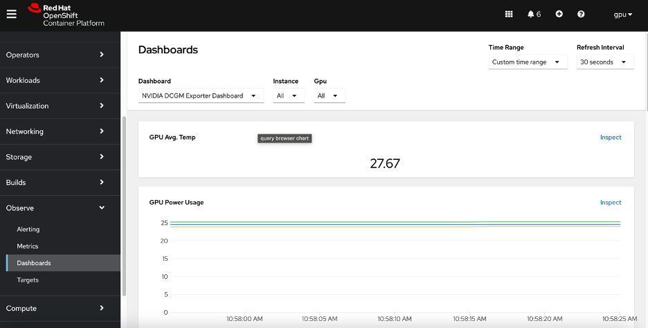

# basic GPU utilization dashboard

In this task we need to Use OpenShift’s Prom Stack to populate a basic GPU utilization dashboard.

## INSTALLATION WORKFLOW 

** All the outputs in output.txt **

1. Download NVIDIA DCGM Exporter.

2. Creating a Configmap from the file we downloaded to openshift-config-managed.

3. Label Configmap to display Dashboard for admin and developer

4. Test to create a resource and test the creation of labels.

5. Displaying the Dashboard in the Openshift console.

